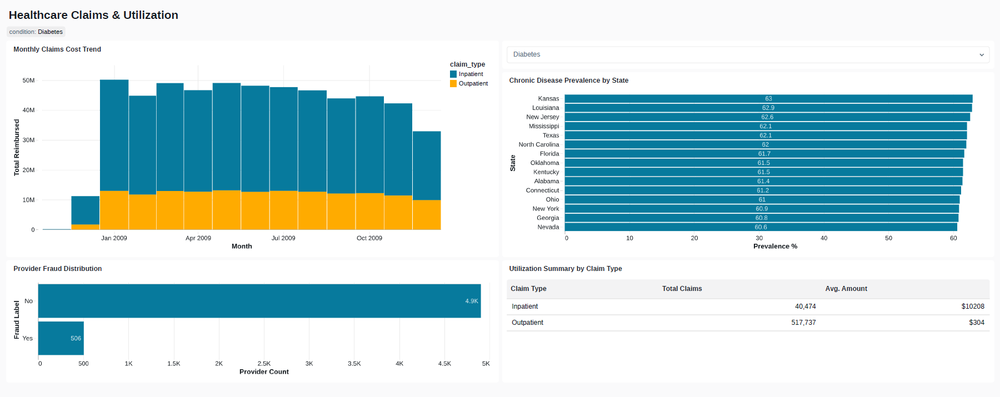
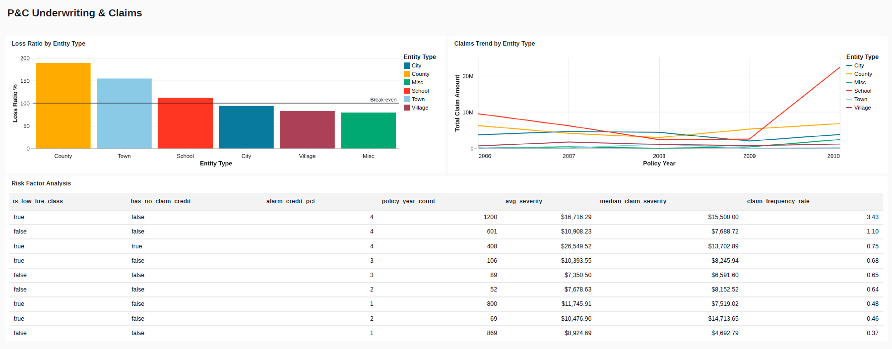
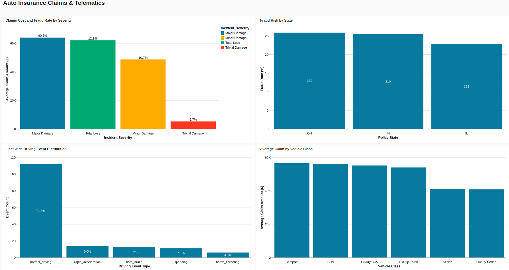
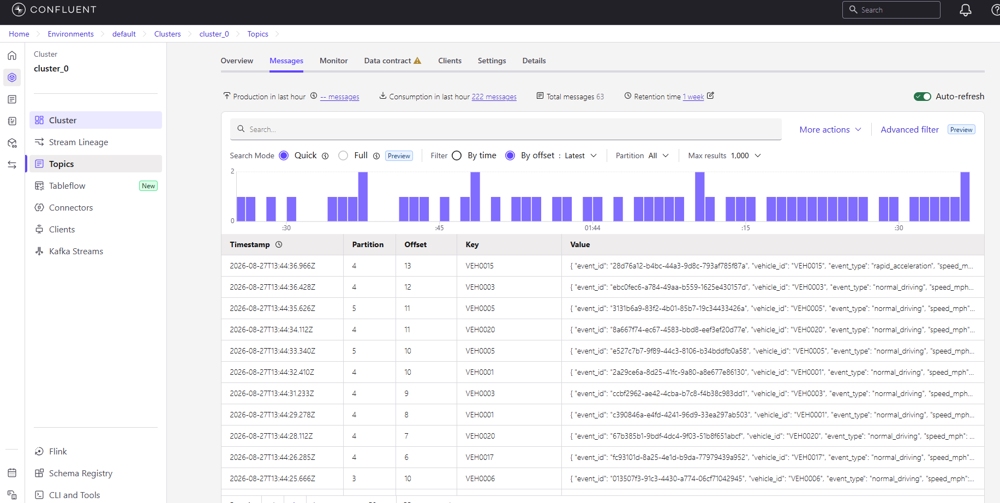

# Databricks Data Engineering Portfolio

End-to-end data engineering projects built on Databricks, demonstrating medallion
architecture, Autoloader, Structured Streaming, Lakeflow Declarative Pipelines,
Databricks Asset Bundles (CI/CD), Workflows/Jobs orchestration, and Genie/Lakeview
dashboards.

## Projects

### [01 - Healthcare Claims & Utilization](./01_healthcare_claims_util)
Medicare-style claims and utilization analytics: bronze/silver/gold medallion
pipeline, provider fraud-risk ML feature table, scheduled Job orchestration,
Lakeflow Declarative Pipeline (alternate implementation), Lakeview dashboard,
and a Genie natural-language query space.

### [02 - Property & Casualty Underwriting & Claims](./02_pc_underwriting_claims)
Underwriting risk factor and loss experience analytics on real Wisconsin
government property insurance data: Lakeflow Declarative Pipeline as the
primary implementation, AI-assisted dashboard authoring, DABs pipeline
deployment, and a Genie space.

### [03 - Auto Insurance Claims & Telematics](./03_auto_insurance_telematics)
Auto insurance claims and fraud analysis combined with real-time telematics
driving-behavior data: live Kafka streaming (Confluent Cloud) via genuine
Structured Streaming, batch claims ingestion via Autoloader, PostgreSQL
Lakehouse Federation for live cross-platform vehicle reference data (Neon),
and a DABs-deployed multi-source Job with parallel task execution.

