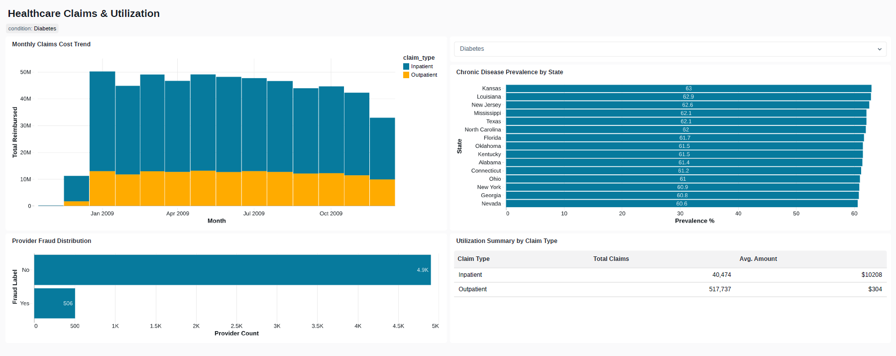
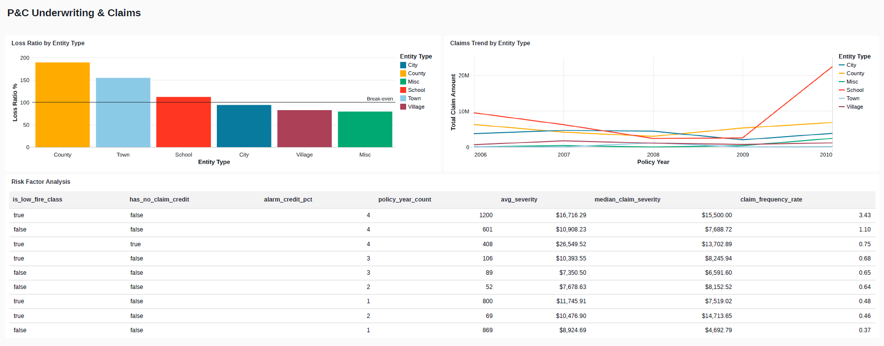
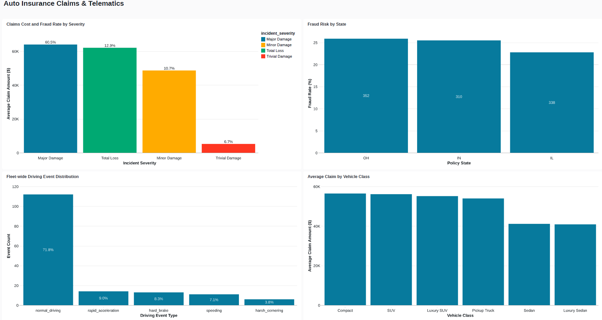
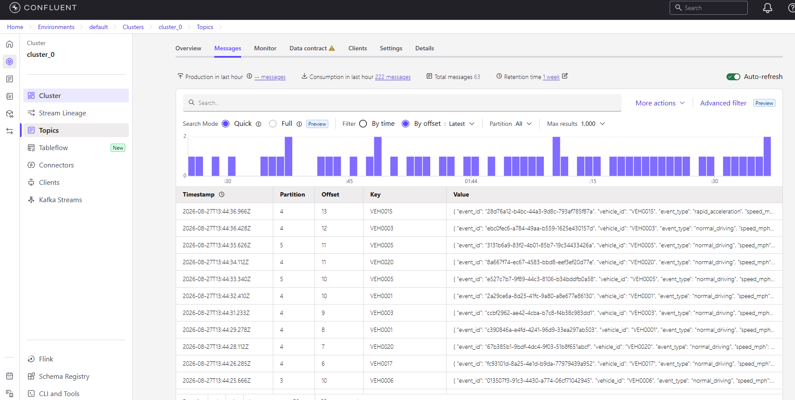
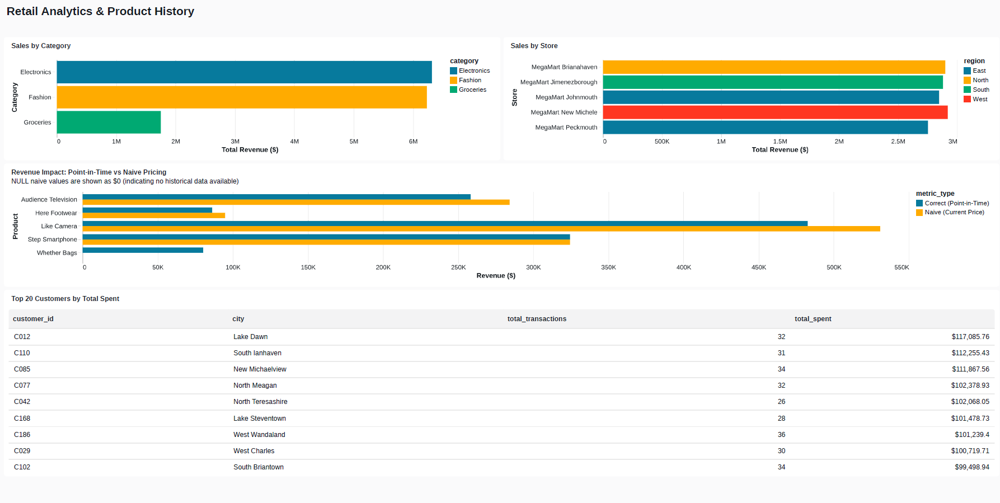
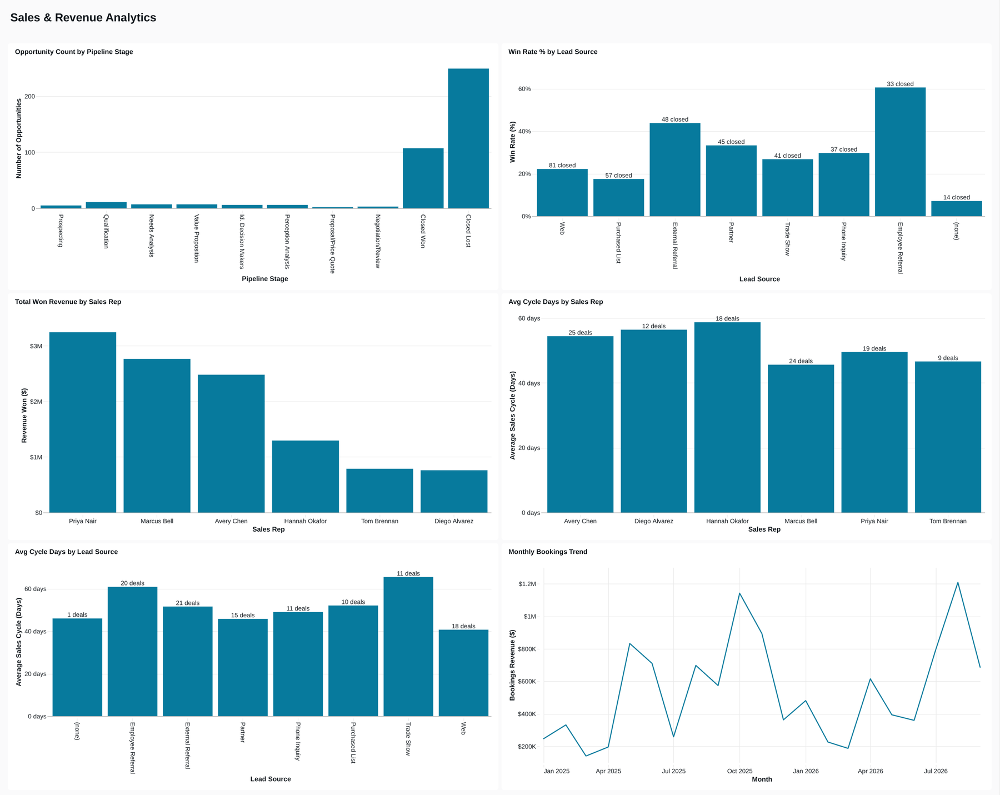

# Databricks Data Engineering Portfolio

End-to-end data engineering projects built on Databricks, demonstrating medallion
architecture, Autoloader, Structured Streaming, Lakeflow Declarative Pipelines,
Databricks Asset Bundles (CI/CD), Workflows/Jobs orchestration, and Genie/Lakeview
dashboards.

## Projects

### [01 - Healthcare Claims & Utilization](./01_healthcare_claims_util)
Medicare-style claims and utilization analytics: bronze/silver/gold medallion
pipeline, provider fraud-risk ML feature table, scheduled Job orchestration,
Lakeflow Declarative Pipeline (alternate implementation), Lakeview dashboard,
and a Genie natural-language query space.

### [02 - Property & Casualty Underwriting & Claims](./02_pc_underwriting_claims)
Underwriting risk factor and loss experience analytics on real Wisconsin
government property insurance data: Lakeflow Declarative Pipeline as the
primary implementation, AI-assisted dashboard authoring, DABs pipeline
deployment, and a Genie space.

### [03 - Auto Insurance Claims & Telematics](./03_auto_insurance_telematics)
Auto insurance claims and fraud analysis combined with real-time telematics
driving-behavior data: live Kafka streaming (Confluent Cloud) via genuine
Structured Streaming, batch claims ingestion via Autoloader, PostgreSQL
Lakehouse Federation for live cross-platform vehicle reference data (Neon),
and a DABs-deployed multi-source Job with parallel task execution.

### [04 - Retail Analytics & Product Dimension History](./04_retail_analytics)
Retail sales analytics on a proper star-schema dataset, centered on a genuine
**SCD Type 2** dimension implementation: a three-step MERGE pattern handling
all four real-world change scenarios (unchanged, changed, new, discontinued),
with a quantified proof table showing the exact dollar impact of skipping
point-in-time history. DABs-deployed with a backfill/recurring-job
architecture split and directly-verified idempotency.

### [05 - Sales & Revenue Analytics](https://github.com/latashat1/databricks-portfolio/blob/main/05_sales_revenue_analytics)

Sales/revenue operations analytics on a live Salesforce CRM org, the first project in this portfolio to demonstrate **true cross-platform orchestration via Apache Airflow** — a general-purpose orchestrator (running locally via Docker) coordinating OAuth-based REST API extraction from Salesforce, incremental extraction via a source-side high-water mark with soft-delete tracking, and Databricks Files API landing, contrasted directly against Databricks' own native Workflows/DABs, which only orchestrate within Databricks itself. DABs-deployed medallion pipeline (bronze/silver/gold), triggered end-to-end from the same Airflow DAG via `DatabricksRunNowOperator`, a Lakeview dashboard, and a Genie space.

